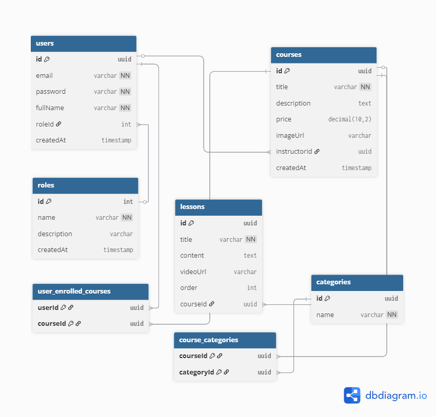
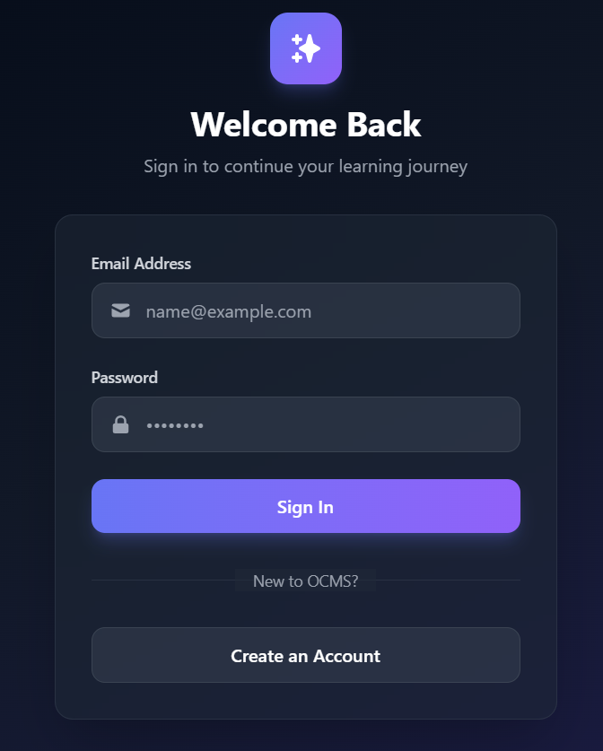
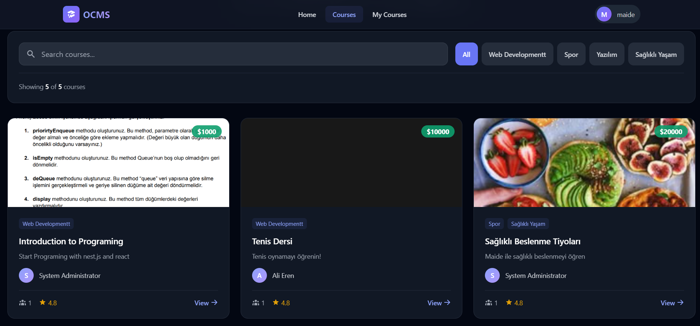
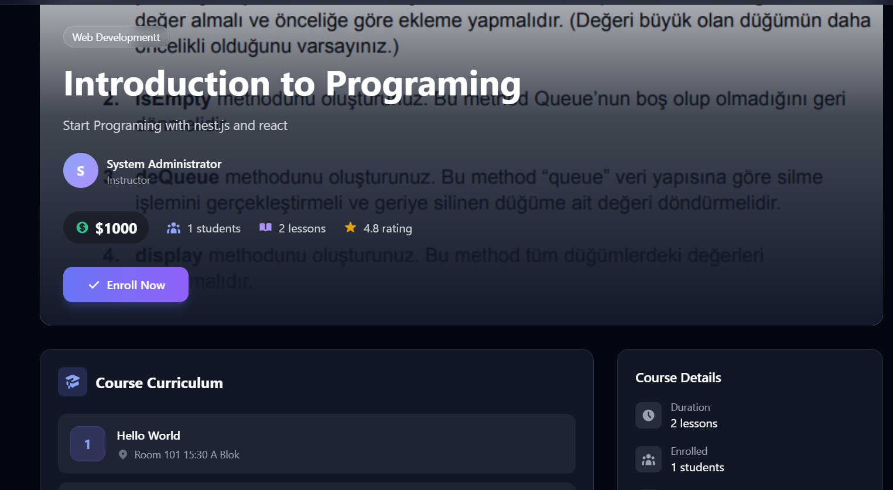
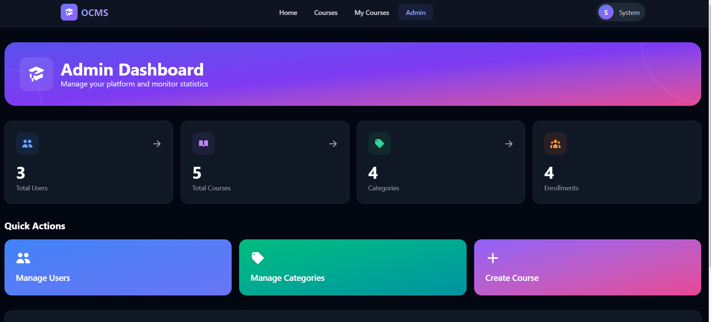

# Online Course Management System (OCMS) - Dönem Projesi Raporu

> **Proje Canlı Bağlantısı:** **[BURAYA PROJE CANLI LİNKİ GELECEK]**

---

## 1. Proje Başlığı ve Giriş

### 1.1 Proje Adı
**Online Course Management System (OCMS)** - Çevrimiçi Kurs Yönetim Sistemi

### 1.2 Projenin Amacı
Bu proje, çevrimiçi kursların yönetimi için geliştirilmiş tam yığın (full-stack) bir web uygulamasıdır. Sistem, Rol Tabanlı Erişim Kontrolü (RBAC - Role-Based Access Control) ile farklı kullanıcı tiplerinin (admin, eğitmen, öğrenci) sisteme farklı yetki seviyeleriyle erişmesini sağlamaktadır.

Proje kapsamında kullanıcılar kayıt olabilir, giriş yapabilir, kurs oluşturabilir, kurslara kayıt olabilir ve ders içeriklerini yönetebilir. Admin kullanıcılar tüm sistem üzerinde tam yetkiye sahipken, eğitmenler yalnızca kendi kurslarını yönetebilmekte, öğrenciler ise kurslara kayıt olup içerikleri görüntüleyebilmektedir.

---

## 2. Kullanılan Teknolojiler

### 2.1 Frontend Teknolojileri

| Teknoloji | Açıklama |
|-----------|----------|
| **React** | Kullanıcı arayüzü geliştirmek için kullanılan JavaScript kütüphanesi |
| **Vite** | Hızlı geliştirme ortamı ve derleme aracı |
| **TypeScript** | Tip güvenli JavaScript geliştirme dili |
| **React Router DOM** | Sayfa yönlendirme ve navigasyon yönetimi |
| **Tailwind CSS** | Hızlı stil verme için utility-first CSS framework |
| **Flowbite React** | Hazır UI bileşenleri kütüphanesi |
| **Axios** | HTTP istekleri için kullanılan istemci kütüphanesi |
| **React Hook Form** | Form yönetimi ve validasyon |
| **React Icons** | İkon kütüphanesi |

### 2.2 Backend Teknolojileri

| Teknoloji | Açıklama |
|-----------|----------|
| **NestJS** | Node.js üzerine kurulu, modüler ve ölçeklenebilir backend framework |
| **TypeORM** | Veritabanı işlemleri için Object-Relational Mapping (ORM) kütüphanesi |
| **PostgreSQL** | İlişkisel veritabanı yönetim sistemi |
| **JWT (JSON Web Token)** | Kullanıcı kimlik doğrulama ve yetkilendirme |
| **Bcrypt** | Şifre hashleme ve güvenli parola saklama |
| **Passport** | Kimlik doğrulama stratejileri için middleware |
| **Multer** | Dosya yükleme işlemleri için middleware |
| **Swagger** | API dokümantasyonu oluşturma |

---

## 3. Veritabanı Tasarımı ve İlişkiler

### 3.1 Ana Varlıklar (Entities)

Projede dört ana varlık (entity) tanımlanmıştır:

#### 3.1.1 User (Kullanıcı)
Kullanıcı varlığı sistemdeki tüm kullanıcıları temsil eder. Her kullanıcının benzersiz bir kimliği, e-posta adresi, şifresi ve tam adı bulunmaktadır. Kullanıcılar bir role sahip olabilir ve kayıt oldukları kurslara erişebilirler.

- **Alanlar:** id, email, password, fullName, roleId, createdAt
- **İlişkiler:** Role ile Many-to-One, Course ile One-to-Many (eğitmen olarak), Course ile Many-to-Many (öğrenci olarak)

#### 3.1.2 Course (Kurs)
Kurs varlığı sistemdeki eğitim kurslarını temsil eder. Her kursun bir başlığı, açıklaması, fiyatı ve kapak görseli bulunmaktadır. Kurslar bir eğitmen tarafından oluşturulur ve birden fazla derse sahip olabilir.

- **Alanlar:** id, title, description, price, imageUrl, createdAt
- **İlişkiler:** User ile Many-to-One (eğitmen), Lesson ile One-to-Many, User ile Many-to-Many (kayıtlı öğrenciler), Category ile Many-to-Many

#### 3.1.3 Lesson (Ders)
Ders varlığı bir kursa ait dersleri temsil eder. Her dersin bir başlığı, içeriği, video bağlantısı ve sıralaması bulunmaktadır.

- **Alanlar:** id, title, content, videoUrl, order
- **İlişkiler:** Course ile Many-to-One

#### 3.1.4 Category (Kategori)
Kategori varlığı kursları sınıflandırmak için kullanılır. Her kategorinin benzersiz bir adı vardır ve birden fazla kurs bu kategoriye ait olabilir.

- **Alanlar:** id, name
- **İlişkiler:** Course ile Many-to-Many

### 3.2 Ek Varlık: Role (Rol)
Rol varlığı kullanıcı yetkilendirmesi için kullanılır. Sistemde admin, instructor (eğitmen) ve student (öğrenci) rolleri tanımlanmıştır.

- **Alanlar:** id, name, description, createdAt
- **İlişkiler:** User ile One-to-Many

---

### 3.3 İlişki Türleri

#### 3.3.1 One-to-Many (Bire-Çok) İlişkileri

| Birincil Varlık | İkincil Varlık | Açıklama |
|-----------------|----------------|----------|
| **Role** | **User** | Bir rol birden fazla kullanıcıya atanabilir. Örneğin, birden fazla kullanıcı "student" rolüne sahip olabilir. |
| **User (Instructor)** | **Course** | Bir eğitmen birden fazla kurs oluşturabilir. Her kursun yalnızca bir eğitmeni vardır. |
| **Course** | **Lesson** | Bir kurs birden fazla derse sahip olabilir. Her ders yalnızca bir kursa aittir. Cascade delete aktifdir; kurs silindiğinde dersleri de silinir. |

#### 3.3.2 Many-to-Many (Çoka-Çok) İlişkileri

| Varlık 1 | Varlık 2 | Ara Tablo | Açıklama |
|----------|----------|-----------|----------|
| **User (Student)** | **Course** | user_enrolled_courses | Bir öğrenci birden fazla kursa kayıt olabilir ve bir kursa birden fazla öğrenci kayıt olabilir. |
| **Course** | **Category** | course_categories | Bir kurs birden fazla kategoriye ait olabilir ve bir kategori birden fazla kursu içerebilir. |

---

---

## 4. Backend API Dokümantasyonu

Backend, RESTful API prensipleriyle tasarlanmış olup altı adet controller içermektedir. Tüm korumalı endpoint'ler JWT token ile yetkilendirme gerektirmektedir.

### 4.1 Auth Controller (/auth)
Kimlik doğrulama işlemlerini yönetir.

| HTTP Metodu | Endpoint | Yetkilendirme | Açıklama |
|-------------|----------|---------------|----------|
| **POST** | /auth/register | Herkese Açık | Yeni kullanıcı kaydı oluşturur. Kullanıcı e-posta, şifre ve tam adını gönderir. Sistem benzersiz e-posta kontrolü yapar ve şifreyi hashleyerek veritabanına kaydeder. |
| **POST** | /auth/login | Herkese Açık | Kullanıcı girişi yapar. Kullanıcı e-posta ve şifresini gönderir, sistem kimlik bilgilerini doğrular ve başarılı ise JWT token döndürür. Bu token, korumalı endpoint'lere erişim için kullanılır. |

---

### 4.2 Users Controller (/users)
Kullanıcı yönetimi işlemlerini yönetir.

| HTTP Metodu | Endpoint | Yetkilendirme | Açıklama |
|-------------|----------|---------------|----------|
| **GET** | /users/profile | Giriş Yapmış Kullanıcı | Mevcut oturum açmış kullanıcının profil bilgilerini döndürür. Token'dan kullanıcı kimliği alınarak ilgili kullanıcı bilgileri getirilir. |
| **PATCH** | /users/profile | Giriş Yapmış Kullanıcı | Mevcut kullanıcının profilini günceller. Kullanıcı kendi ad-soyad gibi bilgilerini değiştirebilir. |
| **GET** | /users | Sadece Admin | Sistemdeki tüm kullanıcıları listeler. Yalnızca admin rolüne sahip kullanıcılar bu endpoint'e erişebilir. |
| **GET** | /users/:id | Giriş Yapmış Kullanıcı | Belirtilen ID'ye sahip kullanıcının bilgilerini döndürür. |
| **PATCH** | /users/:id | Sadece Admin | Belirtilen kullanıcının bilgilerini günceller. Admin, herhangi bir kullanıcının rolünü veya bilgilerini değiştirebilir. |
| **DELETE** | /users/:id | Sadece Admin | Belirtilen kullanıcıyı sistemden siler. Bu işlem geri alınamaz. |

---

### 4.3 Courses Controller (/courses)
Kurs yönetimi işlemlerini yönetir.

| HTTP Metodu | Endpoint | Yetkilendirme | Açıklama |
|-------------|----------|---------------|----------|
| **POST** | /courses | Eğitmen/Admin | Yeni bir kurs oluşturur. Eğitmen veya admin, kurs başlığı, açıklaması, fiyatı ve kategori bilgilerini göndererek yeni kurs oluşturabilir. Oluşturan kullanıcı otomatik olarak kursun eğitmeni olarak atanır. |
| **GET** | /courses | Herkese Açık | Sistemdeki tüm kursları listeler. Her kurs için başlık, açıklama, fiyat, eğitmen bilgisi ve kayıtlı öğrenci sayısı döndürülür. |
| **GET** | /courses/:id | Herkese Açık | Belirtilen ID'ye sahip kursun detaylarını döndürür. Kurs bilgileri, dersler, kategoriler ve kayıtlı öğrenciler dahil edilir. |
| **PATCH** | /courses/:id | Sahibi/Admin | Kurs bilgilerini günceller. Yalnızca kursun sahibi olan eğitmen veya admin bu işlemi gerçekleştirebilir. |
| **POST** | /courses/:id/upload-image | Sahibi/Admin | Kursa kapak görseli yükler. Desteklenen formatlar JPEG, PNG, GIF ve WebP'dir. Maksimum dosya boyutu 5MB olarak sınırlandırılmıştır. |
| **POST** | /courses/:id/enroll | Giriş Yapmış Kullanıcı | Kullanıcıyı belirtilen kursa kaydeder. Kullanıcı kursa kayıt olarak ders içeriklerine erişim kazanır. |
| **DELETE** | /courses/:id/enroll | Giriş Yapmış Kullanıcı | Kullanıcının kurs kaydını iptal eder. Kullanıcı daha önce kayıt olduğu kurstan ayrılabilir. |
| **DELETE** | /courses/:id | Sahibi/Admin | Kursu sistemden siler. Cascade delete nedeniyle kursa ait tüm dersler de silinir. |

---

### 4.4 Lessons Controller (/lessons)
Ders yönetimi işlemlerini yönetir.

| HTTP Metodu | Endpoint | Yetkilendirme | Açıklama |
|-------------|----------|---------------|----------|
| **POST** | /lessons | Eğitmen/Admin | Yeni bir ders oluşturur. Ders başlığı, içeriği, video bağlantısı, sıralaması ve ait olduğu kurs ID'si belirtilmelidir. |
| **GET** | /lessons | Herkese Açık | Tüm dersleri listeler. İsteğe bağlı olarak courseId query parametresi ile belirli bir kursa ait dersler filtrelenebilir. |
| **GET** | /lessons/:id | Herkese Açık | Belirtilen ID'ye sahip dersin detaylarını döndürür. |
| **PATCH** | /lessons/:id | Eğitmen/Admin | Ders bilgilerini günceller. Ders başlığı, içeriği veya sıralaması değiştirilebilir. |
| **DELETE** | /lessons/:id | Eğitmen/Admin | Dersi sistemden siler. |

---

### 4.5 Categories Controller (/categories)
Kategori yönetimi işlemlerini yönetir.

| HTTP Metodu | Endpoint | Yetkilendirme | Açıklama |
|-------------|----------|---------------|----------|
| **POST** | /categories | Sadece Admin | Yeni kategori oluşturur. Kategori adı benzersiz olmalıdır. |
| **GET** | /categories | Herkese Açık | Sistemdeki tüm kategorileri listeler. |
| **GET** | /categories/:id | Herkese Açık | Belirtilen ID'ye sahip kategorinin bilgilerini döndürür. |
| **PATCH** | /categories/:id | Sadece Admin | Kategori bilgilerini günceller. |
| **DELETE** | /categories/:id | Sadece Admin | Kategoriyi sistemden siler. |

---

### 4.6 Roles Controller (/roles)
Rol yönetimi işlemlerini yönetir.

| HTTP Metodu | Endpoint | Yetkilendirme | Açıklama |
|-------------|----------|---------------|----------|
| **POST** | /roles | Sadece Admin | Yeni rol oluşturur. Rol adı ve açıklaması belirtilebilir. |
| **GET** | /roles | Giriş Yapmış Kullanıcı | Sistemdeki tüm rolleri listeler. |
| **GET** | /roles/:id | Giriş Yapmış Kullanıcı | Belirtilen ID'ye sahip rolün bilgilerini döndürür. |
| **PATCH** | /roles/:id | Sadece Admin | Rol bilgilerini günceller. |
| **DELETE** | /roles/:id | Sadece Admin | Rolü sistemden siler. |

---

## 5. Frontend Mimarisi ve Bileşen Açıklamaları

Frontend, React ve TypeScript kullanılarak geliştirilmiştir. Uygulama modüler bir yapıda tasarlanmış olup sayfalar, bileşenler ve düzenler (layouts) şeklinde organize edilmiştir.

### 5.1 Sayfa Bileşenleri (Pages)

#### 5.1.1 Genel Sayfalar

| Sayfa | Dosya Yolu | Açıklama |
|-------|-----------|----------|
| **Ana Sayfa** | pages/Home | Uygulamanın giriş sayfasıdır. Öne çıkan kursları, platformun özelliklerini ve genel tanıtım bilgilerini kullanıcılara sunar. |
| **Giriş Sayfası** | pages/Login | Kullanıcı giriş formunu içerir. Kullanıcı e-posta ve şifresini girerek sisteme giriş yapar. Başarılı giriş sonrası JWT token localStorage'a kaydedilir. |
| **Kayıt Sayfası** | pages/Register | Yeni kullanıcı kayıt formunu içerir. Ad-soyad, e-posta ve şifre alanlarıyla yeni hesap oluşturulur. |
| **Yetkisiz Erişim** | pages/Unauthorized | Kullanıcının erişim yetkisi olmayan sayfalara gitmeye çalıştığında gösterilir. Uygun yönlendirme seçenekleri sunar. |

#### 5.1.2 Dashboard ve Profil

| Sayfa | Dosya Yolu | Açıklama |
|-------|-----------|----------|
| **Dashboard** | pages/Dashboard | Kullanıcının kontrol panelini gösterir. Kayıtlı kurslar, oluşturulan kurslar ve hızlı erişim bağlantıları sunar. |
| **Profil** | pages/Profile | Kullanıcının profil bilgilerini görüntüleme ve düzenleme sayfasıdır. Ad-soyad gibi bilgiler güncellenebilir. |

#### 5.1.3 Kurs Sayfaları

| Sayfa | Dosya Yolu | Açıklama |
|-------|-----------|----------|
| **Kurs Listesi** | pages/Courses | Sistemdeki tüm kursları kartlar halinde listeler. Her kartta kurs başlığı, açıklaması, fiyatı ve eğitmen bilgisi görüntülenir. |
| **Kurs Detayı** | pages/Courses/CourseDetail | Seçilen kursun detay sayfasıdır. Kurs bilgileri, ders listesi, kayıtlı öğrenciler ve eğitmen bilgileri gösterilir. Kayıt olma/ayrılma işlemleri bu sayfadan yapılır. |
| **Kurs Formu** | pages/Courses/CourseForm | Yeni kurs oluşturma ve mevcut kurs düzenleme formunu içerir. Dinamik olarak oluşturma veya güncelleme modunda çalışır. |
| **Kurslarım** | pages/Courses/MyCourses | Kullanıcının kayıt olduğu kursları ve eğitmen ise oluşturduğu kursları listeler. |

#### 5.1.4 Ders Sayfaları

| Sayfa | Dosya Yolu | Açıklama |
|-------|-----------|----------|
| **Ders Formu** | pages/Lessons/LessonForm | Yeni ders oluşturma ve mevcut ders düzenleme formunu içerir. Ders başlığı, içeriği ve video bağlantısı alanlarını içerir. |

#### 5.1.5 Admin Sayfaları

| Sayfa | Dosya Yolu | Açıklama |
|-------|-----------|----------|
| **Admin Paneli** | pages/Admin | Admin kontrol panelinin ana sayfasıdır. Kullanıcı ve kategori yönetimi için bağlantılar sunar. |
| **Kullanıcı Yönetimi** | pages/Admin/Users | Sistemdeki tüm kullanıcıları tablo halinde listeler. Kullanıcı rollerini değiştirme, düzenleme ve silme işlemleri yapılabilir. |
| **Kategori Yönetimi** | pages/Admin/Categories | Kategorileri listeleme, oluşturma, düzenleme ve silme işlemlerini gerçekleştirir. |

---

### 5.2 Ortak Bileşenler (Components)

| Bileşen | Dosya Yolu | Açıklama |
|---------|-----------|----------|
| **Navbar** | components/Navbar | Uygulamanın üst navigasyon çubuğudur. Kullanıcının oturum durumuna ve rolüne göre dinamik menü öğeleri gösterir. Giriş yapmamış kullanıcılara giriş/kayıt bağlantıları, giriş yapmış kullanıcılara profil ve çıkış seçenekleri sunar. Admin kullanıcılar için admin paneli bağlantısı eklenir. |
| **ProtectedRoute** | components/ProtectedRoute | Korumalı sayfalara erişimi kontrol eden wrapper bileşenidir. Kullanıcının oturum durumunu ve gerekli rollere sahip olup olmadığını kontrol eder. Yetkisiz erişim durumunda giriş sayfasına veya yetkisiz erişim sayfasına yönlendirir. |

---

### 5.3 Düzenler (Layouts)

| Düzen | Dosya Yolu | Açıklama |
|-------|-----------|----------|
| **MainLayout** | layouts/MainLayout | Ana uygulama düzenidir. Navbar bileşenini ve sayfa içeriğini (outlet) içerir. Korumalı ve genel sayfalar için kullanılır. |
| **AuthLayout** | layouts/AuthLayout | Kimlik doğrulama sayfaları için kullanılan düzendir. Giriş ve kayıt sayfaları bu düzeni kullanır. Navbar içermez, temiz bir form odaklı tasarım sunar. |

---

### 5.4 İlişki Yönetimi

Frontend üzerinde veritabanı ilişkilerinin yönetimi tam olarak desteklenmektedir:

- **Kurs-Öğrenci İlişkisi (Kayıt İşlemleri):** Kullanıcılar kurs detay sayfasından kurslara kayıt olabilir veya kayıtlarını iptal edebilir. Bu işlemler anlık olarak güncellenir ve kullanıcıya geri bildirim verilir.

- **Kurs-Kategori İlişkisi:** Kurs oluşturma ve düzenleme formunda kategoriler çoklu seçim olarak yönetilir. Bir kurs birden fazla kategoriye atanabilir.

- **Kurs-Ders İlişkisi:** Kurs detay sayfasından dersler eklenebilir, düzenlenebilir ve silinebilir. Dersler sıralama özelliğiyle organize edilir.

- **Kullanıcı-Rol İlişkisi:** Admin panelinde kullanıcıların rolleri değiştirilebilir. Bu sayede bir öğrenci eğitmen yapılabilir veya tersi gerçekleştirilebilir.

---

---

## 6. Sonuç

Online Course Management System (OCMS) projesi, modern web geliştirme teknolojileri kullanılarak başarıyla geliştirilmiştir. Proje, ödev gereksinimlerinde belirtilen tüm kriterleri karşılamaktadır:

### 6.1 Karşılanan Gereksinimler

| Gereksinim | Durum | Açıklama |
|------------|-------|----------|
| **Kimlik Doğrulama (Authentication)** | ✓ Tamamlandı | JWT tabanlı kayıt ve giriş sistemi uygulandı. Token'lar güvenli şekilde yönetilmektedir. |
| **Yetkilendirme (Authorization)** | ✓ Tamamlandı | Rol tabanlı erişim kontrolü (RBAC) ile admin, eğitmen ve öğrenci rolleri tanımlandı. Her rol farklı yetkilere sahiptir. |
| **CRUD İşlemleri** | ✓ Tamamlandı | Tüm varlıklar (User, Course, Lesson, Category, Role) için tam CRUD desteği sağlandı. |
| **One-to-Many İlişkiler** | ✓ Tamamlandı | Role-User, User-Course (eğitmen), Course-Lesson ilişkileri uygulandı. |
| **Many-to-Many İlişkiler** | ✓ Tamamlandı | User-Course (kayıt) ve Course-Category ilişkileri ara tablolarla uygulandı. |
| **Frontend İlişki Yönetimi** | ✓ Tamamlandı | Kullanıcı arayüzünden ilişkilerin eklenmesi, güncellenmesi ve silinmesi mümkündür. |
| **API Dokümantasyonu** | ✓ Tamamlandı | Swagger ile otomatik API dokümantasyonu oluşturuldu. |

### 6.2 Proje Özeti

Proje, NestJS framework'ü ile güçlü ve modüler bir backend mimarisi, React ile dinamik ve kullanıcı dostu bir frontend arayüzü sunmaktadır. TypeORM kullanılarak veritabanı işlemleri type-safe bir şekilde yönetilmekte, JWT ve Bcrypt ile güvenlik sağlanmaktadır.

Sistem, eğitim kurumları, bireysel eğitmenler veya çevrimiçi öğrenme platformları için temel bir altyapı olarak kullanılabilir. Modüler yapısı sayesinde gelecekte yeni özellikler kolayca eklenebilir ve mevcut özellikler genişletilebilir.

---

**Proje Geliştirme Tarihi:** Ocak 2026

**Kullanılan IDE:** Visual Studio Code

**Versiyon Kontrol:** Git
